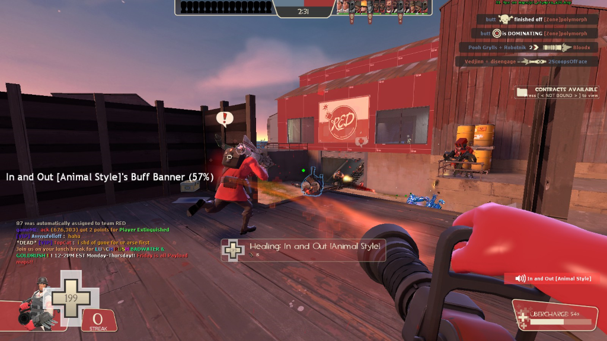

# eotl_mri - Medic Rage Info
This is a TF2 sourcemod plugin I wrote for the [EOTL](https://www.endofthelinegaming.com/) community.

When healing a soldier that has Buff Banner, Battalion's Backup, or Concheror equipped, it will display the soldier's rage percentage on the medic's HUD.

By default mri is disabled for each client.

### Say Commands

**!mri** - enables mri for the client

**!mri disable** - disables mri for the client

mri being enabled/disabled for a client is saved into a client cookie so the setting will persist across connections.

### ConVars

**eotl_mri_display_interval [seconds]**

How often to refresh mri info on the medics HUD

Default: 0.5

**eotl_mri_display_x [float]**

The X location as a percentage from 0.0 to 1.0 of where the rage info should be printed on the medics screen.  0.0 is the left side of the screen, 1.0 is the right side.

Be aware this value is the start location of the text.

Default: 0.01

**eotl_mri_display_y [float]**

The Y location as a percentage from 0.0 to 1.0 of where the rage info should be printed on the medics screen.  0.0 is the top of the screen, 1.0 is the bottom.

Default: 0.5

The above default x/y values put the text in the middle left of the screen as seen in the above picture.

**eotl_mri_debug [0/1]**

Disable/Enable debug logging

Default: 0 (disabled)